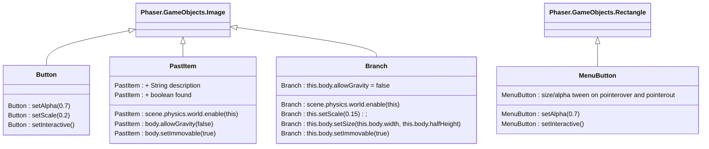

```mermaid
classDiagram
    Phaser.GameObjects.Image <|-- Button
    Phaser.GameObjects.Image <|-- PastItem
    Phaser.GameObjects.Image <|-- Branch
    class Button {
        Button : setAlpha(0.7)
        Button : setScale(0.2)
        Button : setInteractive()
    }
    
    class PastItem {
        PastItem : scene.physics.world.enable(this)
        PastItem : + String description
        PastItem : body.allowGravity(false)
        PastItem : body.setImmovable(true)
        PastItem : + boolean found
    }
    
    class Branch {
        Branch : scene.physics.world.enable(this)
        Branch : this.setScale(0.15);
        Branch : this.body.setSize(this.body.width, this.body.halfHeight)
        Branch : this.body.allowGravity = false
        Branch : this.body.setImmovable(true)

    }

    Phaser.GameObjects.Rectangle <|-- MenuButton

    class MenuButton {
        MenuButton : setAlpha(0.7)
        MenuButton : setInteractive()
        MenuButton : size/alpha tween on pointerover and pointerout
    }
```