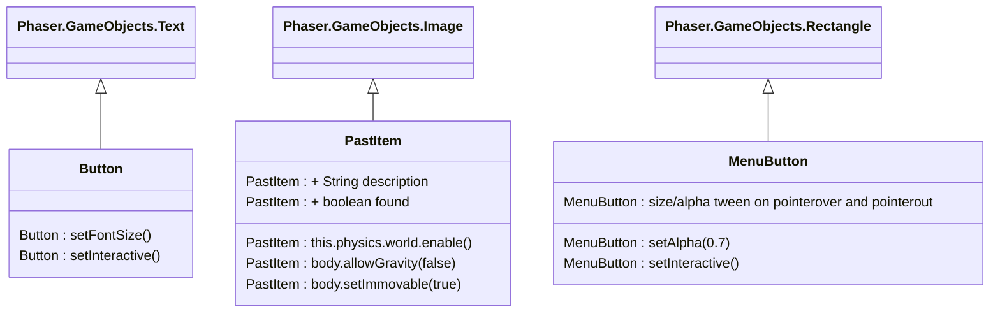

```mermaid
classDiagram
    Phaser.GameObjects.Text <|-- Button
    Phaser.GameObjects.Image <|-- PastItem
    class Button {
        Button : setFontSize()
        Button : setInteractive()
    }
    
    class PastItem {
        PastItem : this.physics.world.enable()
        PastItem : + String description
        PastItem : body.allowGravity(false)
        PastItem : body.setImmovable(true)
        PastItem : + boolean found

    }

    Phaser.GameObjects.Rectangle <|-- MenuButton

    class MenuButton {
        MenuButton : setAlpha(0.7)
        MenuButton : setInteractive()
        MenuButton : size/alpha tween on pointerover and pointerout
    }
```